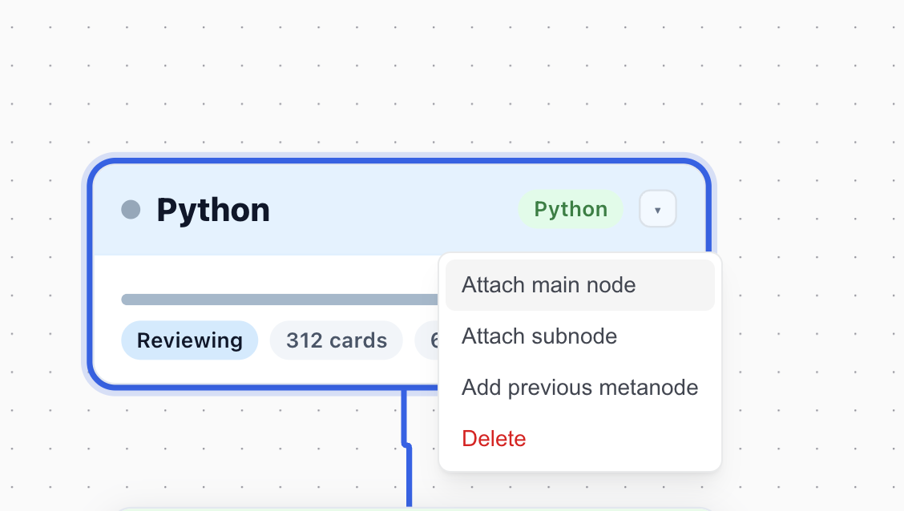
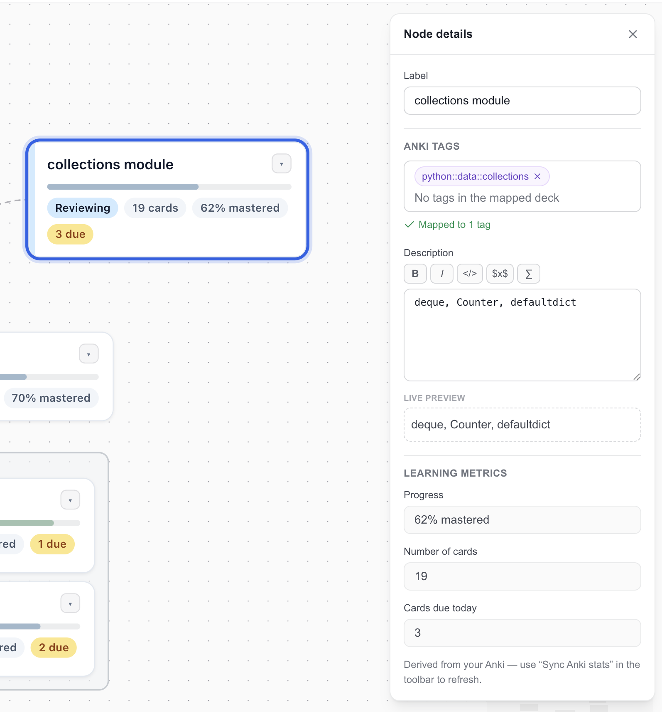

**Your Anki deck knows more about your learning than you do — the roadmap finally lets you see it.** It's a visual map of a subject, connected to your real deck: every topic shows how much of it you've mastered, how many cards back it, and how many are due today.



## The deck was a black box. Now it isn't.

Anki has an old, quiet problem: **a deck is write-only memory.** You pour cards in, and the only interface back is the daily grind of reviews. After six months you have two thousand cards — and no way to *see* what you know. Which areas are solid? Which are quietly decaying? Where are the gaps? The deck can't tell you. You created it, and then it became a black box.

The roadmap inverts that. It makes the structure of your knowledge **visible** — where you're strong, what's decaying, what's next. And the moment you can see that, you stop just *doing reviews* and start **steering**: which subtopic to push this week, where to add cards, what to ask your AI to build out next.

The map stops being a picture of your learning. **It becomes the instrument of it.**

That's also why it matters more than a dashboard. For someone months in, the roadmap isn't a *view* of their process — it *is* their process. It's the same reason losing a paper notebook hurts more than losing the textbook: the textbook is replaceable, the accumulated structure of your own understanding is not.

## What a roadmap is

A roadmap is a tree of topics that you build and read in your dashboard, under the **Roadmap** section:

- **Main topics** form the spine — the backbone of the subject.
- **Subtopics** branch off a main topic — the concrete things you study.
- **Groups** collect related subtopics into one box.
- **Link nodes** sit at either end of the spine and point to another roadmap, so several maps can join into one bigger picture.

You build it out **node by node** — there's no bulk import. You can add nodes by hand in the dashboard, or — the interesting part — **your AI builds it with you** over the Studio MCP endpoint: it reads your deck, proposes a structure, and creates the map one node at a time while you watch.

## How the map connects to your real deck

The connection is two simple bindings:

- The **root topic** is mapped to an **Anki deck** — you pick it from your own decks.
- Each **subtopic** is mapped to one or more **note tags** from that deck. A card counts toward a subtopic when its note carries any of that subtopic's tags.

That's it. Press **Sync Anki stats** (or let your AI do it) and every mapped topic gets its numbers straight from your collection:

| Metric | Meaning |
|---|---|
| **Mastered %** | the share of the topic's cards that are *mature* — review cards Anki has pushed to an interval of 21 days or more, its own definition of "you know this" |
| **Cards** | how many cards back this topic (suspended and buried cards excluded) |
| **Due today** | how many of them are waiting for review right now |

A main topic higher up the spine rolls its numbers up from every subtopic beneath it — so a broad topic shows the combined picture of all the specifics under it, each card counted once. New cards you haven't learned yet stay in the count but aren't "mastered," so a fresh deck starts near 0% and the map fills with color as you actually learn.

Nothing here is self-reported. The percentages come from your real review history, not from what you *feel* you know. And because "mastered" is just Anki's own mature-card cut (21+ day interval), it works whether or not you use FSRS, and it means the same thing everyone else's Anki does. See [The power of Anki](/docs/concepts/power-of-anki/) for why that interval is such a good proxy for real memory.

## Built together with your AI

The roadmap lives on the Studio MCP endpoint, so any connected AI (Claude, ChatGPT, and others) can work on it with you. In one conversation your AI can:

- create a roadmap and grow it topic by topic,
- bind the root to one of your decks and subtopics to your tags,
- sync the stats and read back where you stand,
- and use that to plan with you — "your weakest area is X, let's add cards there."

A conversation might go:

> **You:** Map out my Spanish deck as a roadmap.
>
> **Your AI:** *(lists your decks, creates a "Spanish" roadmap, adds main topics like Grammar and Vocabulary, adds subtopics under each, binds the root to your Spanish deck and the subtopics to their tags, then syncs.)* Done — you're at 68% on Vocabulary but only 24% on Verb Conjugation, and 40 conjugation cards are due today. Want me to add cards for the irregular verbs?

Everything the AI does appears in your dashboard **live** — you watch the map grow while you talk. Behind the scenes it uses tools named `knowledge_map_create`, `knowledge_map_add_node`, `knowledge_map_update_node`, and `knowledge_map_sync_stats`, among others. You never call these yourself; you just describe what you want.

## What you need

- **An AnkiMCP account** — the roadmap is part of your dashboard, and the Studio MCP endpoint added to your AI.
- **Anki running with the [AnkiMCP add-on](/docs/concepts/add-on-vs-cli/)** for stats sync. **Add-on only for now:** the CLI connection can't serve deck statistics, so syncing needs the add-on. When only the CLI is connected, the dashboard shows "CLI connected — download the add-on to sync."
- **The free plan includes one roadmap.** A paid plan removes that limit.

## FAQ

**Do my cards leave my computer?**
No. Only the aggregate numbers — how many cards, how many mature, how many due — travel to the roadmap. The card content stays in your Anki.

**Does it work without FSRS?**
Yes. "Mastered" is based on the 21-day mature-card cut, which every Anki collection has, FSRS or not.

**What counts as a card for a subtopic?**
Any card whose note carries one of the tags you mapped to that subtopic. Tag matching is exact and case-sensitive, and only tags inside the mapped deck are considered.

**Can I still set numbers by hand?**
You can, but syncing owns the numbers on mapped topics — the next **Sync Anki stats** overwrites them from your real deck.
