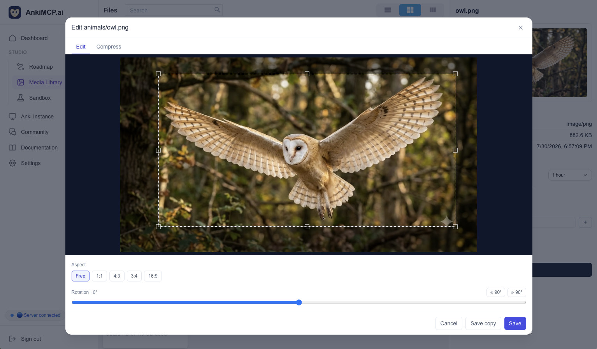
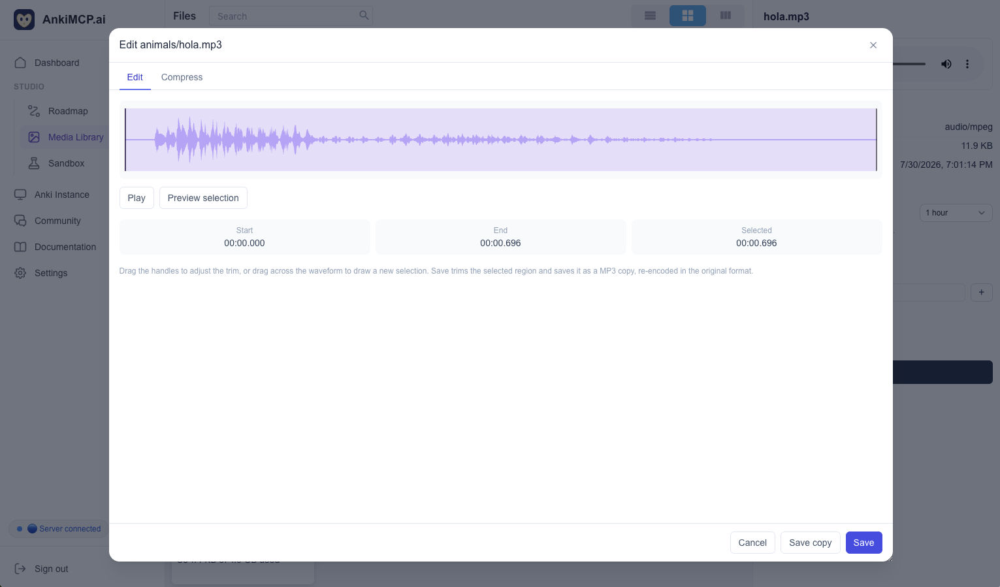

**Your media library keeps the images and sounds your cards use in the cloud, so your AI can reach them.** Upload a picture or an audio clip once, and your AI can find it and reuse it when it builds or edits cards through Studio.

{{< zoom-image src="media-library-overview.png" alt="The Media Library in Anki Studio: a folder tree on the left with animals, flowers and plants folders under My files, the file grid showing owl.png in the animals folder, and the details panel on the right with the image preview, its type, size and date, a Share button for a temporary download link, tags, a description field and an Edit button. The bottom of the tree shows storage used: 882.6 KB of 1.0 GB." width="740" caption="Folders, files, and the details panel — click to enlarge" >}}

## What it's for

Media that only lives on your computer is invisible to your AI, and media buried inside old cards is hard to find and reuse. The library fixes both.

It's a shared shelf for the pictures and sounds you want on your cards: a diagram you reuse across a dozen cards, pronunciation clips for a language deck, a photo you want your AI to build a card around. You put a file there once, and from then on both you and your AI can reach it — no re-uploading, no hunting through your collection.

You'll find it under the **Media Library** section of your dashboard.

## Uploading and organizing

Upload images and audio straight from the dashboard, then arrange them in folders like any file manager — create folders, rename, move, and delete. Each file can also carry **tags** and a **description**, which make files easy to find later (and give your AI useful hints about what each one is).

The library accepts these formats:

- **Images** — PNG, JPEG, WebP, and GIF
- **Audio** — MP3 and WAV

A few limits keep storage sane. These are the current settings and may change:

| Limit | Current value |
|---|---|
| Largest single file | 2 MiB |
| Total storage, free plan | 30 MiB |
| Total storage, paid plan | 1 GiB |

The dashboard shows how much of your space you've used and tells you up front if a file is too large, before the upload starts.

## Editing images and audio

You don't need a separate editor to tidy a file up — the library edits both images and audio right in your browser.

**Images:**

- **Crop** — drag any rectangle freely, or lock to a preset aspect ratio.
- **Rotate** — to any angle.
- **Compress** — shrink the file by lowering quality, with the before-and-after sizes shown side by side.

**Audio:**

- **Trim** — drag a region on the waveform and keep just that part. Trimming preserves the format (a WAV stays a WAV, an MP3 stays an MP3).
- **Convert to MP3** — turn a WAV into a smaller MP3 at a bitrate you pick.
- **Compress** — re-encode an MP3 at a lower bitrate to save space.

When you're done, you choose what happens to the result: **save it as a copy** (under a new name) or **replace the original** in place.

## How your AI uses it

Your AI reaches the library through the Studio MCP endpoint. Its role there is deliberately narrow — it helps you find and describe media and pull files into the cards it builds, but it doesn't reorganize your library behind your back.

Your AI can:

- **Browse** the library — walk your folders and list what's there, with each file's name, type, size, tags, and description (`media_library_read_directory`).
- **Open a file** — read one image or sound and get a fresh, temporary link it can use to actually view or hear it (`media_library_read_file`).
- **Label a file** — update a file's tags and description so it's easier to find later (`media_library_update_file`).

Uploading, deleting, moving, and renaming are **yours to do in the dashboard** — your AI can't do those over MCP. So a typical flow is: you upload a diagram and give it a clear name, then in your next conversation your AI finds it, previews it, and puts it on the cards it drafts with you in the [Sandbox](/docs/anki-studio/sandbox/).

---

*Disclaimer: "Anki" is a registered trademark of Ankitects Pty Ltd. AnkiMCP is an independent, community-built project and is **not** affiliated with, endorsed by, or sponsored by Ankitects. MCP is an open standard originated by Anthropic; AnkiMCP is likewise not affiliated with or endorsed by Anthropic.*
