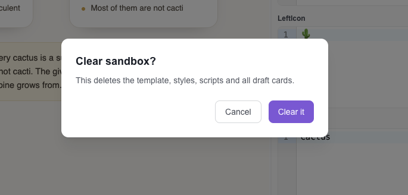

**The sandbox is where cards are made — together.** Your AI drafts a card, you see it render instantly in the dashboard the way Anki will show it, you fix a word or restyle it, and the AI picks up your changes and continues. Nothing touches your real deck until you say so.



## The idea in one paragraph

Making good Anki cards with an AI has an awkward gap: the AI writes HTML it can't see, and you see cards you didn't write. The sandbox closes the gap with one shared, live workspace. You and your AI are editing the same draft at the same time — the AI works through its Studio tools, you work in the dashboard, and every change shows up on the other side almost at once. The preview isn't an imitation: it renders your note type's real styling, template, and scripts the same way Anki does.

## What's in a sandbox

You get one sandbox per account, and it holds **one note type at a time**:

- **The template** — the note type's styling (CSS), scripts (JS), field names, and card layout, usually fetched by your AI straight from your Anki.
- **Draft cards** — each card is just its field values; all cards share the one template.

The editor panel on the right has four tabs: **HTML** (the fields of the card you've selected), **CSS** (the shared stylesheet), **JS** (the shared script), and **Template** (the question and answer layout). The **Show answer / Show question** button flips the preview between the two sides.

You can start from nothing, too: the editors are always there, and typing into them creates a fresh sandbox on the spot — no AI required.

## How many cards you can draft

A sandbox holds up to **20 draft cards** at once. On the **free plan** the dashboard keeps you to **one card per sandbox**; a paid plan lets you stack more, up to that limit of 20. Your AI can add cards up to the same cap.

## Drafts, not storage

The sandbox is a workbench, not a deck. When a card is ready, your AI pushes it to your real Anki over the connection it already has, then removes it from the sandbox. Drafts you leave untouched expire on their own after about **two weeks**. And **Clear sandbox** wipes the whole thing — template, styles, scripts, and every draft — when you want a clean bench.

## Approving a card into your deck

The sandbox deliberately has **no button that pushes to Anki** — that keeps it a safe draft space. Instead, once you're happy with a card, your AI adds it to your real deck using the very same Anki connection it uses everywhere else (the same tool it would use to add any note), then clears it from the sandbox. So the flow is: **AI drafts → you polish live → you approve → AI pushes to Anki.** Because the push goes through your normal connection, the card lands in whatever deck you tell it, exactly like any other card your AI makes.

## What the preview supports today

The preview aims to render cards exactly as Anki does, but not every Anki template feature is built yet. What gets added next from this list is driven by what people ask for.

| Anki feature | Sandbox today |
|---|---|
| `{{Field}}` substitution | ✅ |
| `{{FrontSide}}` on the answer side | ✅ |
| Question / answer side preview | ✅ |
| Note type CSS | ✅ |
| Template `<script>` JS (hints, toggles) | ✅ |
| Shared session JS | ✅ |
| MathJax math (`\(…\)`, `\[…\]`, `<anki-mathjax>`) | ✅ |
| Images by URL (media library) | ✅ |
| Audio `[sound:…]` | ⚠️ plays for URL references only |
| Images by bare Anki filename | ❌ |
| Conditional sections `{{#Field}}` / `{{^Field}}` / `{{/Field}}` | ❌ |
| Field filters (`{{hint:…}}`, `{{text:…}}`, `{{furigana:…}}`, …) | ❌ |
| Cloze deletions `{{c1::…}}` | ❌ |
| Special fields (`{{Tags}}`, `{{Deck}}`, `{{Type}}`, `{{Card}}`) | ❌ |
| Type-in answers (`{{type:Field}}`) | ❌ |
| Multiple card templates per note type (e.g. Basic + reversed) | ❌ one template per sandbox |
| Full LaTeX (`[latex]…[/latex]`, `[$]…[$]`, packages, TikZ) | ❌ |
| Night mode preview | ❌ |
| Text-to-speech (`{{tts …}}`) | ❌ |
| Image occlusion | ❌ |

A note on the two conditional rows: the preview doesn't *evaluate* conditionals or filters — it strips the markers and shows the plain field value — so a card that leans heavily on them will look right in real Anki but plainer here. Images and audio show up as long as they're referenced by a web link (for example a link from your [Media Library](/docs/anki-studio/media-library/)); a bare Anki filename won't resolve in the preview.

## What you need

- **An AnkiMCP account** with the Studio MCP endpoint added to your AI. New to that? See [Connect MCP clients](/docs/how-to/connect-mcp-clients/).
- **Your Anki connected** so the AI can fetch your note type's styling and, later, push the approved cards. Either connection works — see [Add-on vs CLI](/docs/concepts/add-on-vs-cli/).

---

*Disclaimer: "Anki" is a registered trademark of Ankitects Pty Ltd. AnkiMCP is an independent, community-built project and is **not** affiliated with, endorsed by, or sponsored by Ankitects. MCP is an open standard originated by Anthropic; AnkiMCP is likewise not affiliated with or endorsed by Anthropic.*
