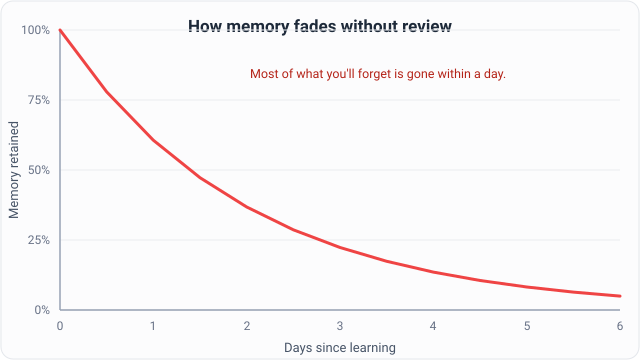
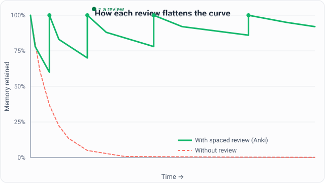

**Anki works because it fights how your brain forgets.** It shows you each fact right before you'd lose it. You confirm you still know it, and the next review moves further out. So you remember more while studying less.

You've felt the problem if you ever crammed for a test, passed, then forgot it all a week later. This page explains the science in plain words, so you know why the method works.

## Why do we forget what we learn?

We forget because memory fades fast after we learn, unless we refresh it. This isn't a personal flaw. It's how human memory is built.

In the 1880s, German psychologist Hermann Ebbinghaus ran the first memory experiments on himself. He memorized lists of nonsense syllables, then tracked how much he kept over time. His results gave us the **forgetting curve**: memory drops steeply soon after learning, then the decline slows.

The key point isn't an exact percentage. It's the *shape*. You lose most of what you forget early. That's why reading a chapter once feels productive but rarely sticks.

*The forgetting curve: without a refresher, most of what you'll forget is gone within a day.*

> Ebbinghaus published his work in 1885.[\[1\]](#ref-1) It is one of the most replicated findings in psychology. In 2015, researchers redid his experiment with his original method and got strikingly similar results,[\[2\]](#ref-2) confirming the curve still describes how memory fades today.

## What is the spacing effect?

The **spacing effect** is simple: you remember far more when study sessions are spread out instead of crammed together.

Picture two students. One studies four hours in one night. The other studies one hour a week for four weeks. Same total time, yet weeks later the second student remembers much more.

This is one of the most solid findings in learning science. A large 2006 review by Cepeda and colleagues looked at hundreds of experiments and confirmed that spacing reliably improves what you keep.[\[3\]](#ref-3) They also found that **the longer you want to remember something, the longer the gaps between reviews should be**.

That insight, *space your reviews and stretch the gaps*, is the heart of every spaced repetition system, including Anki.

## What is active recall, and why does it beat re-reading?

**Active recall** means pulling information from memory instead of re-reading or highlighting it. Trying to remember an answer works far better than just looking at it again.

Scientists call this the **testing effect**, and it surprises people. We assume tests only *measure* what we know. In fact, testing yourself *builds* the memory.

A well-known 2006 study by Roediger and Karpicke showed this.[\[4\]](#ref-4) Some students tested themselves on a passage. Others just re-read it. Right after studying, the re-readers did slightly better. But two days to a week later, the self-testers remembered much more.

This is exactly what a flashcard does. You see the front, struggle to recall the answer, then flip it. That struggle cements the memory.

## How does Anki turn this into a system?

Anki combines spacing and active recall, then handles the scheduling for you. You never plan your own review timetable.

Here's what happens each time you review a card:

1. **You recall, then rate.** Anki shows the front. You try to recall the answer, reveal it, and tell Anki how it went: *Again*, *Hard*, *Good*, or *Easy*.
2. **Anki schedules the next review.** If you recalled it easily, Anki waits longer before showing it again. If you struggled, it brings the card back soon.
3. **Intervals grow.** Each success stretches the gap. You review hard cards often and easy cards rarely.

So you tend to see each card right when you'd otherwise forget it. That's the best moment to refresh a memory.

*Every review catches the memory and resets it. Each time, it fades more slowly, so retention stays high while a never-reviewed memory (dashed) collapses.*

### What is FSRS?

Modern Anki uses a scheduler called **FSRS** (the Free Spaced Repetition Scheduler)[\[5\]](#ref-5) to decide when each card is due. It is open source, built by the Open Spaced Repetition community, and on by default in recent Anki versions.

You don't need the math to benefit. FSRS tracks three things about each card:

- **Difficulty** — how hard this fact is for you.
- **Stability** — how long the memory will last before you'd forget it.
- **Retrievability** — how likely you are to recall it right now.

FSRS learns from your review history and aims for a target you set, called **desired retention** (90% by default).[\[6\]](#ref-6) It then plans each card to hit that target with the fewest reviews. You can read more on the [Open Spaced Repetition project on GitHub](https://github.com/open-spaced-repetition/free-spaced-repetition-scheduler).

## Who benefits from Anki?

Anyone who needs to remember a lot of facts reliably and for a long time. Spaced repetition shines where durable knowledge matters more than one grade.

- **Language learners** — thousands of small facts that need to stick for years.
- **Medical and nursing students** — huge volumes of terms and mechanisms.
- **Exam preppers** — the MCAT, bar exams, and certifications test broad recall months later.
- **Professionals** — keeping legal codes, medical guidelines, or syntax fresh after study ends.
- **Lifelong learners** — geography, history, or anything you want to keep, not relearn.

If forgetting is your enemy, Anki is built to help.

## What's the catch?

The catch is that Anki only works if *you* do two things: make good cards and show up to review them.

First, the payoff. You get durable memory for a small, steady amount of daily study. By reviewing only what you're about to forget, you remember far more than cramming, in less total time.

But writing clear, well-formed cards is real work. And the daily review habit takes discipline. For many people, that friction is exactly where good intentions stall.

That's the gap worth closing. What if an AI assistant could turn what you're studying into well-formed cards, and quiz you through reviews like a patient tutor? That's the problem **AnkiMCP** was built to solve, and it's where the rest of this guide goes next.

## Common questions

**Is Anki hard to learn?** The basics are quick: you make cards, then review them daily and rate how each one went. Anki has many advanced options, but you can ignore them and still get the full benefit.

**How is this different from normal flashcards?** Paper flashcards show every card at the same rate. Anki schedules each card on its own, so you see hard cards often and easy cards rarely. That saves time and targets what you're about to forget.

**Do I have to review every day?** Daily review works best, because it matches the spacing effect and keeps your workload small. You can skip days, but cards pile up and a backlog forms.

---

*Disclaimer: "Anki" is a registered trademark of Ankitects Pty Ltd. AnkiMCP is an independent, community-built project and is **not** affiliated with, endorsed by, or sponsored by Ankitects.*

## Sources and further reading

1. Ebbinghaus, H. (1885). *Über das Gedächtnis (Memory: A Contribution to Experimental Psychology)*. [Full text (Ruger & Bussenius translation)](https://psychclassics.yorku.ca/Ebbinghaus/index.htm) · Overview: [Forgetting curve — Wikipedia](https://en.wikipedia.org/wiki/Forgetting_curve)
2. Murre, J. M. J., & Dros, J. (2015). Replication and Analysis of Ebbinghaus' Forgetting Curve. *PLOS ONE, 10*(7), e0120644. [DOI: 10.1371/journal.pone.0120644](https://doi.org/10.1371/journal.pone.0120644)
3. Cepeda, N. J., Pashler, H., Vul, E., Wixted, J. T., & Rohrer, D. (2006). Distributed practice in verbal recall tasks: A review and quantitative synthesis. *Psychological Bulletin, 132*(3), 354–380. [PubMed](https://pubmed.ncbi.nlm.nih.gov/16719566/)
4. Roediger, H. L., & Karpicke, J. D. (2006). Test-enhanced learning: Taking memory tests improves long-term retention. *Psychological Science, 17*(3), 249–255. [DOI: 10.1111/j.1467-9280.2006.01693.x](https://doi.org/10.1111/j.1467-9280.2006.01693.x) · [PubMed](https://pubmed.ncbi.nlm.nih.gov/16507066/)
5. FSRS — Free Spaced Repetition Scheduler: [Open Spaced Repetition on GitHub](https://github.com/open-spaced-repetition/free-spaced-repetition-scheduler)
6. Anki Manual — Deck Options & FSRS: [docs.ankiweb.net](https://docs.ankiweb.net/deck-options.html)
