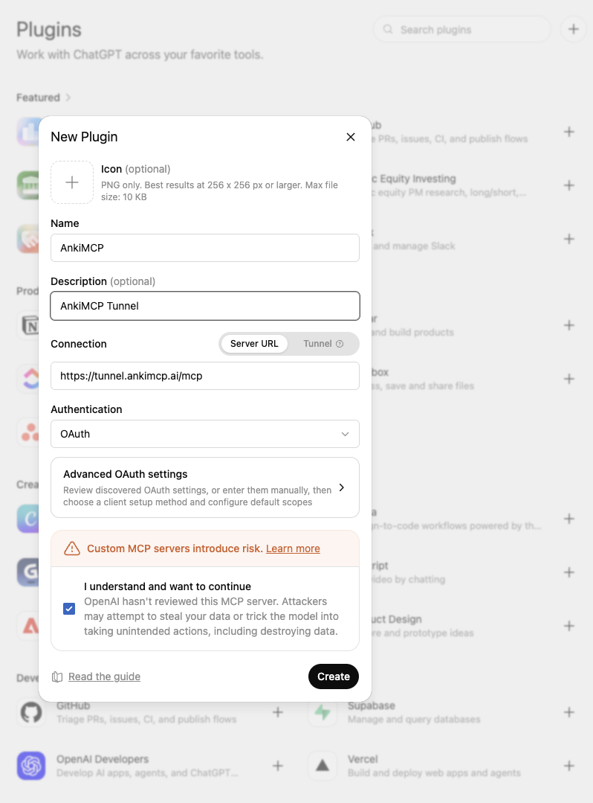
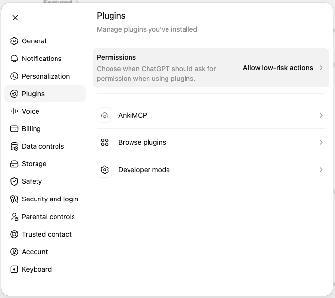

**Connect ChatGPT to Anki with the AnkiMCP add-on's built-in tunnel, so ChatGPT can read your decks and build cards from your browser.**

ChatGPT runs in the cloud, so it can't see Anki on your computer. The AnkiMCP **add-on** fixes this. It runs inside Anki and, with one click, gives your collection a secure public web address that ChatGPT can reach. You turn on the tunnel, sign in once, and paste the address into ChatGPT.

## What you need

- A **ChatGPT account** on a plan that supports custom apps (MCP connectors). You'll add the tunnel as one. To check whether your plan supports them, see [OpenAI's help page on connectors](https://help.openai.com/en/articles/11487775-connectors-in-chatgpt).
- **Anki 25.07 or later**, open on your computer. Get it from [apps.ankiweb.net](https://apps.ankiweb.net/).
- The **AnkiMCP add-on** for Anki, code `124672614`. You'll install it below.
- An **AnkiMCP account**. The tunnel has a [free tier and a paid tier](/pricing/). You sign in the first time you connect it.

**Time:** about 5 minutes.

## Why a tunnel?

ChatGPT runs on a remote server, not on your machine. It has no way to reach `localhost`, where Anki lives. The add-on's tunnel relays messages between ChatGPT and your local Anki over a secure, signed-in connection. Your cards never leave your control, and the link is private to your account.

## Step 1: Install the AnkiMCP add-on

The add-on starts a small server inside Anki. It launches on its own every time you open Anki.

1. Open Anki.
2. Go to **Tools → Add-ons → Get Add-ons...**
3. Enter this code: `124672614`
4. Click **OK**, then restart Anki.


## Step 2: Connect the tunnel and sign in

Now turn on the tunnel so your Anki gets a public web address.

1. Go to **Tools → AnkiMCP Server Settings...**
2. Click **Connect Tunnel**.
3. A login dialog shows a one-time code. Click **Open Browser** and enter that code on the page that opens.
4. Approve the sign-in. The add-on saves your login, so you won't repeat this each time.


## Step 3: Copy the tunnel URL

The tunnel address is the same for everyone:

```text
https://tunnel.ankimcp.ai/mcp
```

It's safe to share, because it only works after you sign in — requests reach your Anki only when the AI app is signed in with **your** account. Copy that URL. You'll paste it into ChatGPT next.


## Step 4: Add the tunnel to ChatGPT

In ChatGPT, go to **Settings → Plugins → Browse plugins**, then click the **+** button in the top-right corner. The **New Plugin** dialog opens.

1. Give it a **Name**, like `AnkiMCP`. The icon and description are optional.
2. Under **Connection**, keep **Server URL** selected and paste your tunnel URL.
3. Leave **Authentication** on **OAuth**. ChatGPT reads the right settings from the URL.
4. Check the box **I understand and want to continue** to accept ChatGPT's custom-MCP risk notice.
5. Click **Create**.
6. ChatGPT asks you to sign in to AnkiMCP — sign in and approve. AnkiMCP then appears in **Settings → Plugins**.





## Check it worked

Keep Anki open, then ask ChatGPT: **"List my Anki decks."**

If it names your real decks, the tunnel works. You can now ask it to make cards, search your collection, or review with you.

## Fix common problems

**ChatGPT can't connect.**
Make sure Anki is open and the tunnel shows as connected in **Tools → AnkiMCP Server Settings...**. The tunnel only relays while Anki is running. Reconnect the tunnel if needed.

**ChatGPT connects but sees no decks.**
Anki itself may be closed. Open Anki and confirm the tunnel is connected in **Tools → AnkiMCP Server Settings...**.

**Sign-in didn't open my browser.**
The login dialog shows a backup link and code. Open the link and enter the code to approve.

## Common questions

**Do I have to pay?**
The add-on is free. The tunnel has a free tier to get started and a paid tier for higher limits — see [pricing](/pricing/).

## Next steps

- New to local vs. remote? Read [Remote vs local access](/docs/concepts/remote-vs-local/) to choose the right path.
- Want better cards? Try these [AI prompts for Anki](/docs/how-to/anki-ai-prompts/).

---

*Disclaimer: "Anki" is a registered trademark of Ankitects Pty Ltd. AnkiMCP is an independent, community-built project and is **not** affiliated with, endorsed by, or sponsored by Ankitects. MCP is an open standard originated by Anthropic; AnkiMCP is likewise not affiliated with or endorsed by Anthropic.*
